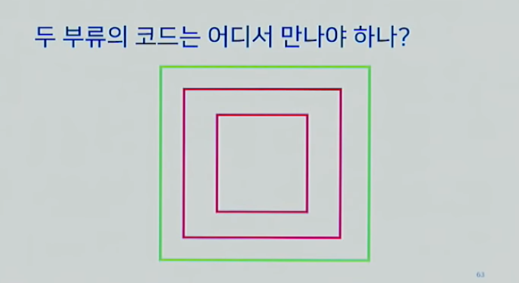
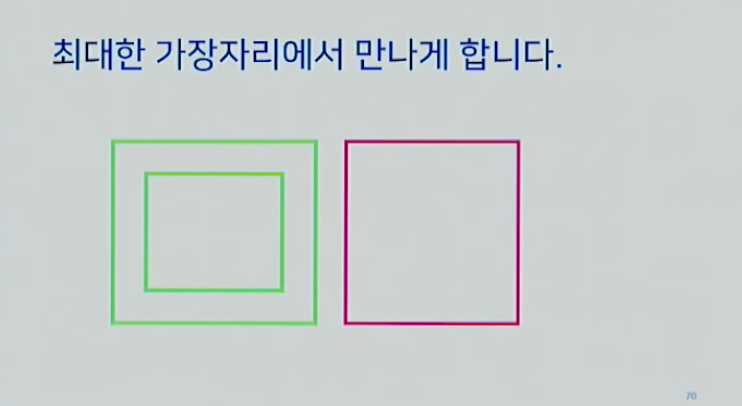
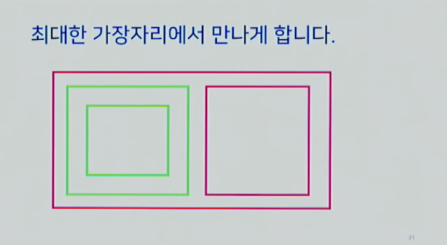
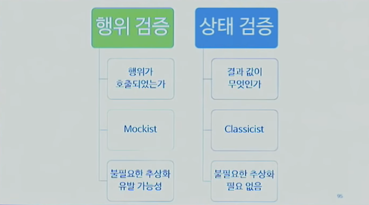
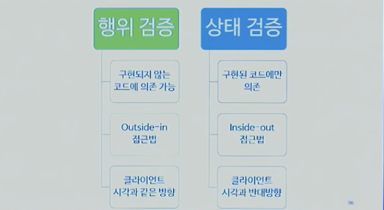
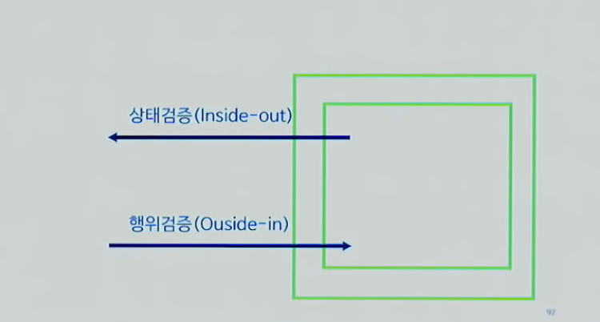
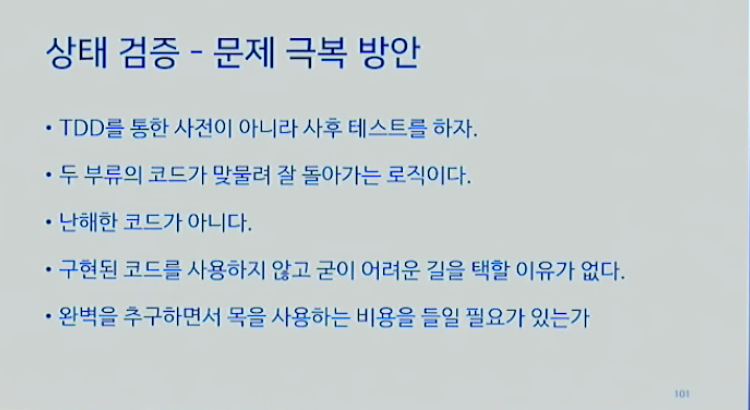
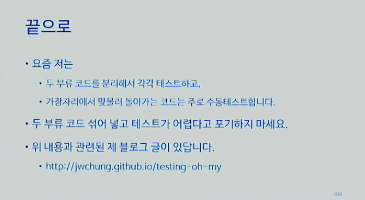

# 정진욱 - 테스트하기 쉬운 코드로 개발하기

## 테스트하기 쉬운 코드란?

- 같은 입력에 항상 같은 결과를 반환하는 코드 => 결정적인, Deterministic
- 외부 상태를 변경하지 않는 코드 => 부수 효과가 없는, No side effects

## 테스트하기 쉬운 코드로 개발하기

예를 들어, 아래 컨퍼런스 등록 단계 중 테스트하기 어려운 건?

1. ConferenceRegistration 유효성 검사
2. `이미 등록된 좌석 수 DB에서 읽어오기` => 항상 같은 값을 반환받는 걸 보장하지 못하므로
3. 요청한 좌석 수가 확보 가능한지 판단
4. `등록 정보 저장` => 외부 상태를 변경하므로
5. HTTP 결과 반환

### 방법 1 - 테스트하기 쉬운 코드와 어려운 코드를 분리

요청한 좌석 수가 확보 가능한지 테스트하는 건 쉽지만, 
이를 테스트하기 위해 DB에 테스트 데이터를 설정해야 하는 문제가 발생한다. 
DB가 항상 같은 값을 반환하지 않기에, 그리고 테스트 데이터가 필요하기에 3번 과정도 테스트하기가 어려워지는 문제가 발생한다.

- 참고로 테스트가 어렵다는 건, 테스트가 불가능하다는 말이 아니다. 사전 작업이 무겁다는 의미를 말한다.

이때 해결 방법은 `분리`하는 것.

### 중간 TDD 맛보기

TDD 원칙 : 테스트를 구현하고, 그에 맞는 구현을 할 때는 TDD를 만족하는 만큼만 구현 코드를 작성한다.

- 테스트 코드는 1개인데, 그 테스트 코드에 대응하는 구현 코드가 3개면 => 구현 코드2,3은 테스트 커버리지를 벗어나기 때문이다.
- 테스트 커버리지를 벗어나는 것 뿐만 아니라, TDD는 기본적으로 점진적인 접근법이다. 구현2,3은 이러한 점진적이라는 TDD의 장점도 잃어버리게 만든다.

즉, 구현 코드는 테스트를 통과하는 만큼만 작성하며, 점진적으로 스케일업해나가는 걸 원칙으로 삼는다.

### 방법 2 - 두 부류의 코드는 어디서 만나야 하는가? (두 부류의 코드는 가장 자리에 위치시키자ㄴ)

코드를 메소드로 분리했다면, 어디서 만나야 하는가? 즉, 어떤 메소드가 이 두 부류의 코드를 호출해야 하는가? 

이때, 메소드 호출로 인해 메소드 간의 층위가 생길 수밖에 없으며, 
안쪽에 있는 코드가, 테스트하기 어려운 코드라면 => 그걸 호출하고 있는 바깥 메서드도 테스트하기 어려운 코드가 되어버린다. 
뿐만 아니라, 계속해서 바깥으로 전파돼서 모든 메서드가 테스트하기 어려운 코드가 되어 버린다.

이제 문제의 초점은 '어떻게 하면 전파를 막고, 가능한 테스트하기 쉬운 코드를 확보할 것인가'로 옮겨가야 한다.

해결 방법은 테스트하기 어려운 코드를 분리하고, 최대한 가장자리에서 만나게 하는 것이다.

즉, 최대한 바깥 쪽에 위치한 메서드에서 Composition을 할 것이다. 
물론, 코드는 필연적으로 만나야 하므로 둘을 접합하는 메서드는 테스트하기 어려운 코드가 되더라도, 
테스트하기 쉬운 코드를 이전보다는 더 많이 확보할 수 있게 된다.

예를 들어, 우리가 지금 계속 논의하고 있는 `컨퍼런스 등록`에서는 
post api라는 가장자리에서 두 테스트 코드가 만나게 하는 게 목표인 것이다.

참고로, 여기서 가장자리라는 건 무조건 바깥쪽이 아니라 당연히 ㄴ상대적인 개념이다.

- 예를 들어, 로깅은 외부 상태 변경에 대한 것이므로 테스트하기 어려운 코드에 속하지만, 항상 바깥쪽에 위치할 이유는 없다.
- 퍼사드 패턴의 경우도, 어떤 클래스나 메서드를 조합해서 사용하기 쉬운 메서드를 제공하기 위함인데 거기에 항상 테스트하기 쉬운 코드만 조합해서 퍼사드를 만들라는 법도 없다.
- ...

최대한 가장자리에 만나되, 여기에 매몰되지는 말자.

### 방법 3 - 두 부류의 코드가 만나는 가장자리는 어떻게 테스트하는가?

가장자리를 테스트하는 방법은 2가지

- 수동 테스트
- 자동 테스트 (행위 검증과 상태 검증)

지금까지의 논의는 자동화된 테스트지만, 테스트에는 사람이 직접하는 테스트도 존재한다.

- query, postman으로 직접 요청을 날려서 사람이 직접 확인할 수 있다.
- 필요에 따라, 무조건 자동화된 테스트 코드만 테스트라고 할 이유는 없다.
- 단, 수동으로 테스트한다는 것의 의미는 자동화 테스트가 필요하지 않을 만큼 단순하다는 의미가 어느 정도 내포되어 있다.

#### 자동화 테스트를 해보자면.

post 메서드 자체는 데이터를 준비해야 하므로 테스트하기 어려운 코드다. 
post 메서드를 테스트하기 위해 코드를 작성하면 되며, response.ok를 항상 가정하고 테스트 케이스를 추가하면 된다. 
이 자체는 문제가 되지 않는다.

문제는 어디서 발생하냐면,

- 누군가가 테스트하기 위해 만들어 놓은 기존 구현 메서드를 사용하지 않고, 직접 수동으로 테스트를 할 때.
- 하지 않아도 될 일을 하고 있기 때문에 문제가 된다.

이미 작성된 코드를 사용할 수 있게끔 강제할 수는 없는가?

- 코드 디자인 설계를 바꾸거나, 그게 어렵다면
- 실제 클래스 대신 Mock 사용을 위한 이음새(Seam)가 있어야 한다.

테스트를 위한, 가상의 Mock 객체를 사용할 때, 실제 클래스와의 이음새가 필요하다.

- 이를 위해 인터페이스, 추상 클래스 뿐만 아니라 보철 메서드 등을 사용하기에 이를 통칭해 `이음새`라고 표현한다.
- 일반적으로 Mock은 직접 작성하지 않고 라이브러리를 주로 사용한다.

### Mock 사용은 장점만 있을까? (행위 검증과 상태 검증)

Mock을 사용해서 자동 테스트를 강제할 수 있지만, 장점만 있는 건 아니다.

Mock을 사용하는 건 `행위 검증`에 해당한다. 
이전에 Mock을 사용하지 않고 작성한 코드는 `상태 검증`으로 대표된다.

상태 검증을 하면, 결과값으로 비교를 하는 반면 
Mock을 사용하면 결과값보다는 어떤 메소드가 호출되었는지(행위)에 관심을 두게 된다.

Mock을 사용하기 위해 인터페이스와 같은 이음새를 만들게 되는데, 
이 인터페이스가 오로지 테스트만을 위한 것이고 제품을 위한 게 아니라면 `불필요한 추상화`에 해당한다.

또한 Mock은 이음새에 의존하므로, 구현되지 않은 인터페이스 코드에 의존하는 게 가능하다. (Outside-in 기법이라고 한다.)

Mock을 사용하면 바깥쪽 메서드가 안쪽 메서드를 호출하는 구조인데, 
안쪽 코드가 구현되어 있지 않더라도 인터페이스를 만들어 놓고 구현되어 있다고 가정하고 테스트를 한 뒤에 안쪽 메서드를 구현할 수 있다.

반대로, 상태검증은 그렇게 할 수가 없다. 안쪽부터 만들고, 바깥쪽을 만들어야 하므로.

### 정진욱님의 경험 - Mock 사용의 단점과 상태 검증으로 돌아가기

Mock을 남발할 가능성이 크다.

- 사용 예제가 간단하면 문제가 되지 않지만, 실제 프로젝트에 적용하면 Mock의 수가 너무 많아진다.
- 적절한 수의 Mock은 어느 정도인지 기준 잡기가 어렵다.

기존에 만들어 두었던 클래스를 사용하지 않았던 이유는, 
구현되어 있는 걸 몰랐기 때문 => 테스트 코드를 먼저 작성하고 구현 코드를 작성했기 때문. 
구현 코드를 작성하고 사후 테스트 코드 작성을 하면 문제가 되지 않을 것 같다.

## References

[[OKKYCON: 2018] 정진욱 - 테스트하기 쉬운 코드로 개발하기](https://www.youtube.com/watch?v=Cz_a2gQp63c) 

### To be

[[OKKYCON: 2018] 박재성 - 의식적인 연습으로 TDD, 리팩토링 연습하기](https://www.youtube.com/watch?v=cVxqrGHxutU) 
