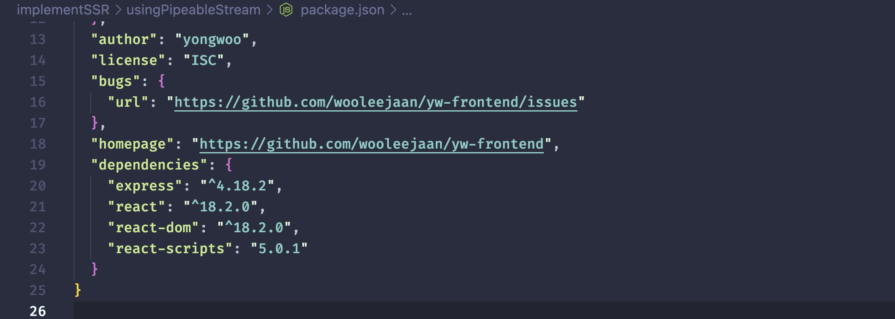
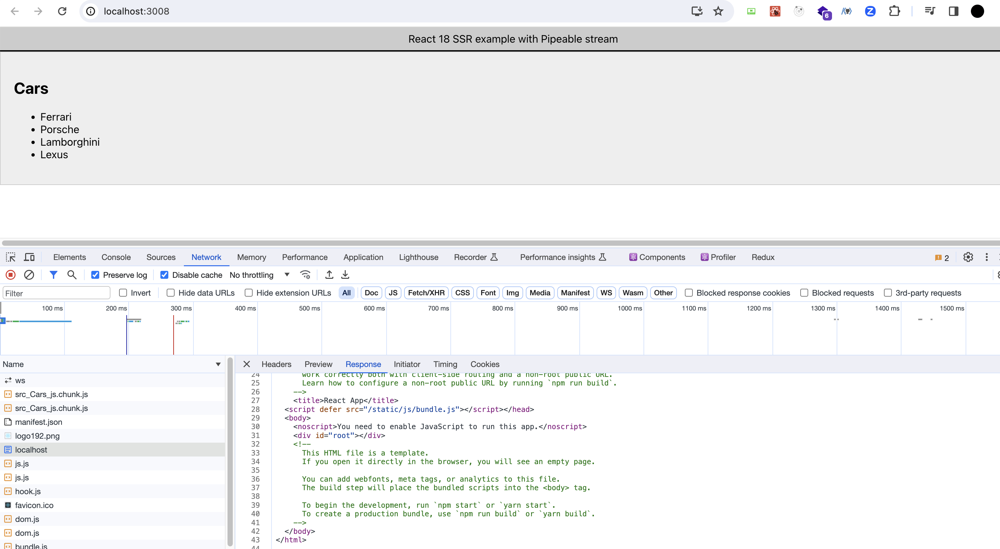

# Implement SSR in react 18 using pipeable stream in nodejs

## Features

### 초기 세팅 (client side / server side workspace)

```bash
cd usingPipeableStream
npm init

npx create-react-app ssr-client # after creating the Bootstrap.js file
```

ssr-client라는 이름의 React 폴더에서 다음 패키지들을 루트 package.json으로 옮깁니다.

```js
"react": "^18.2.0",
"react-dom": "^18.2.0",
"react-scripts": "5.0.1",
```

루트 경로에서 express까지 설치합니다. `npm i express`<br>
그리고 나서 루트경로에서 `npm i`를 진행합니다.



다음 패키지들을 설치합니다.

```bash
npm i cross-env
npm i -D @babel/plugin-syntax-dynamic-import
npm i -D @babel/preset-env
npm i -D @babel/preset-react
npm i -D @babel/register
npm i -D babel-plugin-dynamic-import-node
npm i -D ignore-styles
```

그리고 package.json에서 main을 지우고 workspace를 추가하고, scripts를 작성합니다.

```js
/* ... */
"workspaces": [
    "ssr-client"
],
"scripts": {
    "start:server": "node Bootstrap.js",
    "start:client": "cross-env PORT=3008 npm run start --workspace ssr-client",
    "build:client": "npm run build --workspace ssr-client"
},
/* ...*/
```

### 프론트엔드 코드 작성 - CSR

`/ssr-client/src/` 경로에 Cars 컴포넌트를 작성하고,
App.js에서 Cars 컴포넌트에 lazy 처리를 합니다. 그리고 Suspense로 감싸줍니다.

완성한 App.js를 AppSSR.js 파일에 아래와 같이 import하고 코드를 작성합니다.

```js
// ssr-client/src/AppSSR.js

import App from "./App";
import PropTypes from "prop-types";

const AppSSR = ({ bootStrapCSS }) => {
  console.log("Rendering App component on server-side");
  return (
    <html>
      <head>
        <meta charSet="utf-8" />
        <meta name="viewport" content="width-device-width, initial-scale=1" />
        <title>SSR React 18 example</title>
        {bootStrapCSS.map((cssPath) => (
          <link key={cssPath} rel="stylesheet" href={cssPath}></link>
        ))}
      </head>
      <body>
        <div id="root">
          <App />
        </div>
      </body>
    </html>
  );
};

AppSSR.propTypes = {
  bootStrapCSS: PropTypes.arrayOf(PropTypes.string).isRequired,
};

export default AppSSR;
```

테스트를 위해 프론트엔드 개발서버를 엽니다.<br>
`npm run start:client`

개발자 도구를 확인해보면, 우리가 일반적으로 알듯이 div:root만 존재하는 CSR(Client Side Rendering)임을 확인할 수 있습니다.


