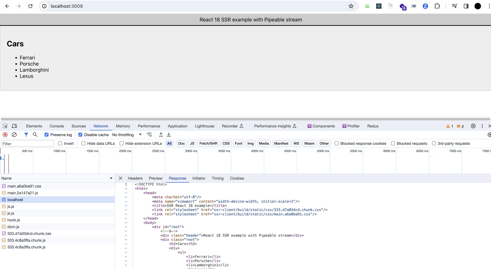
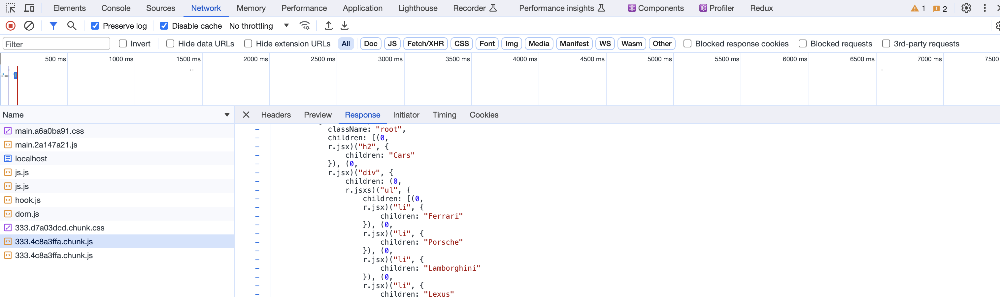

# Implement SSR in react 18 using pipeable stream in nodejs

## Features

### 초기 세팅 (client side / server side workspace)

```bash
cd usingPipeableStream
npm init

npx create-react-app ssr-client # after creating the Bootstrap.js file
```

ssr-client라는 이름의 React 폴더에서 다음 패키지들을 루트 package.json으로 옮깁니다.

```js
"react": "^18.2.0",
"react-dom": "^18.2.0",
"react-scripts": "5.0.1",
```

루트 경로에서 express까지 설치합니다. `npm i express`<br>
그리고 나서 루트경로에서 `npm i`를 진행합니다.


다음 패키지들을 설치합니다.

```bash
npm i cross-env
npm i -D @babel/plugin-syntax-dynamic-import
npm i -D @babel/preset-env
npm i -D @babel/preset-react
npm i -D @babel/register
npm i -D babel-plugin-dynamic-import-node
npm i -D ignore-styles
```

그리고 package.json에서 main을 지우고 workspace를 추가하고, scripts를 작성합니다.

```js
/* ... */
"workspaces": [
    "ssr-client"
],
"scripts": {
    "start:server": "node Bootstrap.js",
    "start:client": "cross-env PORT=3008 npm run start --workspace ssr-client",
    "build:client": "npm run build --workspace ssr-client"
},
/* ...*/
```

### 프론트엔드 코드 작성 - CSR

`/ssr-client/src/` 경로에 Cars 컴포넌트를 작성하고,
App.js에서 Cars 컴포넌트에 lazy 처리를 합니다. 그리고 Suspense로 감싸줍니다.

완성한 App.js를 AppSSR.js 파일에 아래와 같이 import하고 코드를 작성합니다.

```js
// ssr-client/src/AppSSR.js

import App from "./App";
import PropTypes from "prop-types";

const AppSSR = ({ bootStrapCSS }) => {
  console.log("Rendering App component on server-side");
  return (
    <html>
      <head>
        <meta charSet="utf-8" />
        <meta name="viewport" content="width-device-width, initial-scale=1" />
        <title>SSR React 18 example</title>
        {bootStrapCSS.map((cssPath) => (
          <link key={cssPath} rel="stylesheet" href={cssPath}></link>
        ))}
      </head>
      <body>
        <div id="root">
          <App />
        </div>
      </body>
    </html>
  );
};

AppSSR.propTypes = {
  bootStrapCSS: PropTypes.arrayOf(PropTypes.string).isRequired,
};

export default AppSSR;
```

테스트를 위해 프론트엔드 개발서버를 엽니다.<br>
`npm run start:client`

개발자 도구를 확인해보면, 우리가 일반적으로 알듯이 div:root만 존재하는 CSR(Client Side Rendering)임을 확인할 수 있습니다.


### Node.js 코드 작성 (babel, SSR)

Bootstrap 코드를 작성합니다.

```js
// Bootstrap.js

require("ignore-styles");
require("@babel/register")({
  ignore: [/(node_modules)/],
  presets: [
    "@babel/preset-env",
    [
      "@babel/preset-react",
      {
        runtime: "automatic",
      },
    ],
  ],
  plugins: [
    "@babel/transform-runtime",
    "@babel/plugin-syntax-dynamic-import",
    "babel-plugin-dynamic-import-node",
  ],
});

require("./Server.js");
```

Server.js 파일을 작성합니다.

- 이때 클라이언트의 정적 파일이 필요하므로 빌드를 진행합니다. `npm run build:client`
- ssr-client/build에 정적 파일이 생성되므로 이를 사용합니다. (`ssr-client/build/static`이 정적 파일의 루트 경로가 됩니다.)

아래 그림처럼 package.json에 homepage 경로를 작성하고 다시 `npm run build:client`를 실행합니다.


```js
// Server.js

import React from "react";
import ReactDOMServer from "react-dom/server";
import path from "path";
import AppSSR from "./ssr-client/src/AppSSR";
import express from "express";
import fs from "fs";

const app = express();
const port = 3009;

const bootstrapScripts = [];
const bootstrapCSS = [];
const staticPathRoot = "ssr-client/build/static";

const ReadDirectoryContentToArray = (folderPath, array) => {
  fs.readdir(path.join(__dirname, folderPath), (err, files) => {
    if (err) {
      return console.log(`Unable to scan this folder: ${folderPath}`);
    }

    files.forEach((fileName) => {
      if (
        (fileName.startsWith("main.") && fileName.endsWith(".js")) ||
        fileName.endsWith(".css")
      ) {
        array.push(`${folderPath}/${fileName}`);
      }
    });
  });
};

ReadDirectoryContentToArray(`${staticPathRoot}/js`, bootstrapScripts);
ReadDirectoryContentToArray(`${staticPathRoot}/css`, bootstrapCSS);

app.get("/$", (req, res) => {
  res.socket.on("error", (error) => console.log("Fatal error occurred", error));

  let didError = false;
  const stream = ReactDOMServer.renderToPipeableStream(
    <AppSSR bootStrapCSS={bootstrapCSS} />,
    {
      bootstrapScripts,
      onShellReady: () => {
        res.statusCode = didError ? 500 : 200;
        res.setHeader("Content-type", "text/html");
        stream.pipe(res);
      },
      onError: (error) => {
        didError = true;
        console.log("Error", error);
      },
    }
  );
});

app.use(
  "/ssr-client/build/static",
  express.static(__dirname + "/ssr-client/build/static")
);

app.listen(port, () => {
  console.log(`Application started on port ${port}`);
});
```

/ssr-client/src/index.js 파일을 아래와 같이 변경합니다.

```js
// /ssr-client/src/index.js
import React from "react";
import ReactDOMClient from "react-dom/client";
import "./index.css";
import App from "./App";

ReactDOMClient.hydrateRoot(document.getElementById("root"), <App />);
```

이제 `npm run start:server` 명령어를 실행합니다.

localhost:3009로 들어가보면, CSR과 달리 full content가 담겨서 오는 걸 확인할 수 있습니다.



결과적인 dom tree는 다음과 같습니다.


App.js에서 Cars 컴포넌트를 lazy 처리했기 때문에 chunk 파일이 따로 오는 것도 확인할 수 있습니다.



`view-source:http://localhost:3009/`에서 소스코드도 확인할 수 있습니다.

## References

[renderToPipeableStream | React](https://react.dev/reference/react-dom/server/renderToPipeableStream)<br>
[React 18 SSR Pipeable Stream](https://gitlab.com/codeching/react-18-ssr-pipeable-stream)<br>
[Implement server-side rendering (SSR) in React 18 using Pipeable Stream in NodeJS – step by step](https://www.youtube.com/watch?v=bYFfm2Vgml0)<br>
