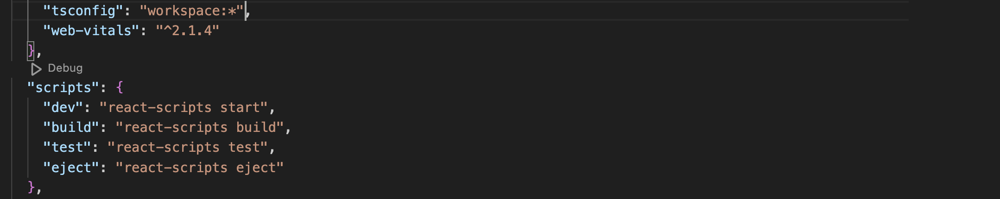
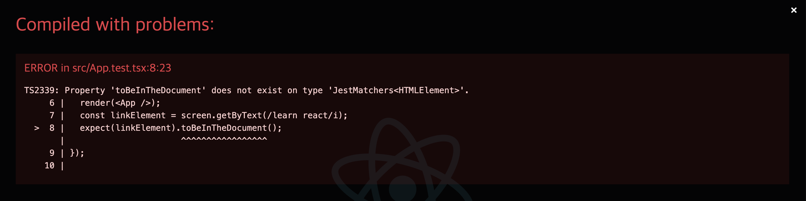
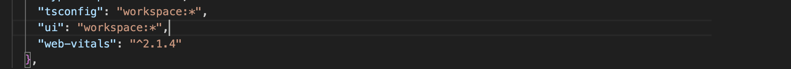
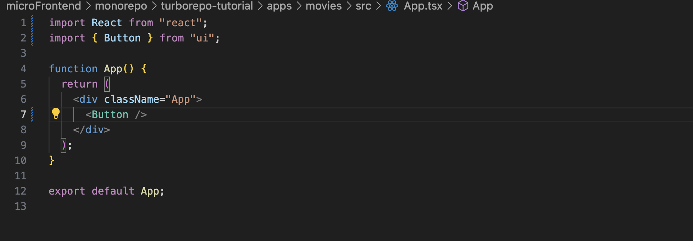
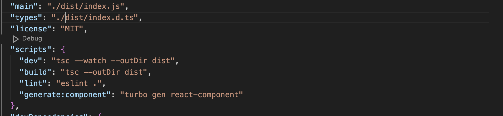
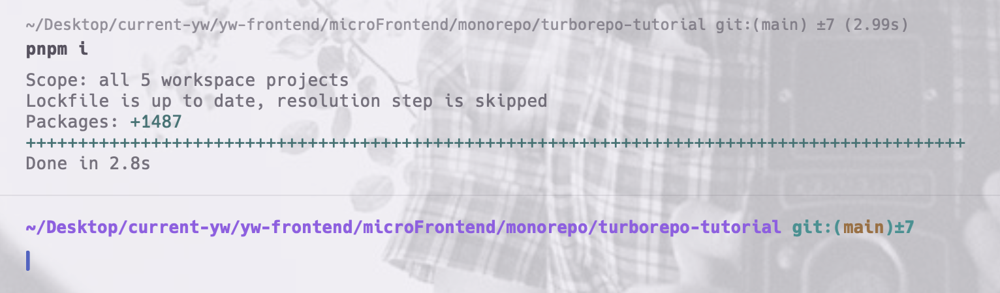

# Turborepo tutorial

## Features

### 새로운 App 설치

`cd apps`로 이동한 뒤, `pnpx create-react-app movies --template typescript` 등 다양한 앱들을 삽입할 수 있습니다.

### default Apps 제거 & workspace의 tsconfig를 개별 App에 추가

기존에 nextjs 프로젝트인 docs, web 앱들을 제거해주고 새로운 앱을 주입합니다.<br>
그러기 위해, 먼저 apps/movies의 package.json 일부분 수정해줘야 합니다.



dependencies에 `"tsconfig": "workspace:*"`를 추가해줘서 turborepo 루트의 packages의 tsconfig를 따르도록 변경해줍니다.<br>
turborepo에서 `pnpm dev`로 실행할 예정이므로 스크립트도 start에서 dev로 변경해줍니다.

그리고 tsconfig.json을 기존 docs에 있는 코드 그대로 복사해서 주입해줍니다.

```js
// .../apps/movies/tsconfig.json

{
  "extends": "tsconfig/nextjs.json",
  "compilerOptions": {
    "plugins": [{ "name": "next" }]
  },
  "include": ["next-env.d.ts", "**/*.ts", "**/*.tsx", ".next/types/**/*.ts"],
  "exclude": ["node_modules"]
}

```

그리고 web, docs 앱 2개를 삭제하고 루트에서 pnpm dev를 실행하면 다음과 같이 뜹니다.<br>
movies app의 `App.test.tsx` 파일을 삭제해주면 됩니다.

- 참고로 위와 같이 설정을 바꿨다면, `cd movies`로 가서 `rm -fr node_modules/`로 모듈들을 제거한 뒤, 루트에서 다시 `pnpm install`을 하고 `pnpm dev`로 재시작해야 합니다.



### workspace의 ui packages를 개별 App에 추가 & CRA를 위한 pre-build

movies의 package.json에 workspace ui를 추가하고, 다시 루트에서 `pnpm install`를 합니다.



아래와 같이 movies app.tsx에서 ui packages에서 컴포넌트를 가져오면 에러가 발생합니다.



`/packages/ui`로 가서 다음과 같이 package.json을 수정합니다.

- scripts에 dev, build를 다음과 같이 추가합니다.
- main, types의 경로를 다음과 같이 수정합니다. dist에 build될 것이므로 ./dist에서 index.js와 index.d.ts를 찾아야 합니다.



그리고 나서 `cd packages/ui`로 가서 `pnpm build`를 수행한 뒤, 다시 루트에서 pnpm dev를 실행하면 정상적으로 import할 수 있습니다.

이렇게 해야 하는 이유는 다음과 같습니다. (그러므로 이후 workspace의 ui package를 사용할 때 pre-build를 해야 합니다.)

- nextjs는 webpack config가 cra과 다른 방식으로 되어 있습니다.
- cra의 경우 외부 모듈의 ts build를 지원하지 않습니다.
- 그러므로 우리는 packages/ui에서 typescript를 pre-build해야 합니다.

### 패키지 설치 및 리액트 버전 관리 (@mantine, react-router-dom)

@mantine 패키지를 packages/ui와 apps/movies에 각각 설치합니다.

```bash
cd packages/ui
pnpm add @mantine/hooks @mantine/core

cd ../../apps/movies/
pnpm add @mantine/hooks @mantine/core
```

그리고 나서 프로젝트 루트(../monorepo/turborepo-tutorial)에서 `pnpm i`를 입력한다.



mantine에 대한 `pnpm install`은 packages/ui > apps/movies, root(여기서는 turborepo-tutorial) 순으로 각각 해줍니다.

버전 충돌 문제는 react 버전을 18.1.~로 맞춰야 합니다.

react-router-dom은 packages/ui에만 설치합니다. `pnpm add react-router-dom@6.3.0`

packages/ui의 index.tsx에서 라우터를 구성합니다.<br>
apps/movies/src/App.tsx에서는 이제 path와 라우터에 들어갈 요소만 작성해주면 됩니다.

###

22:22~
