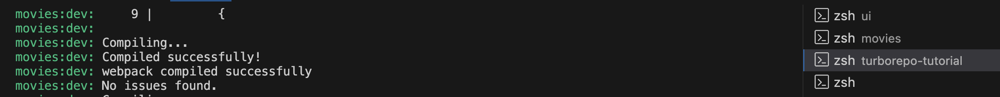
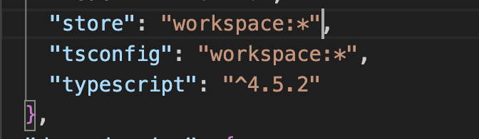
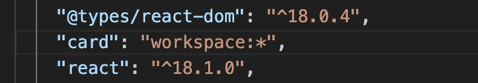
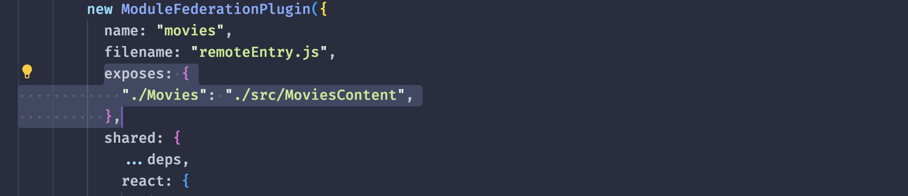
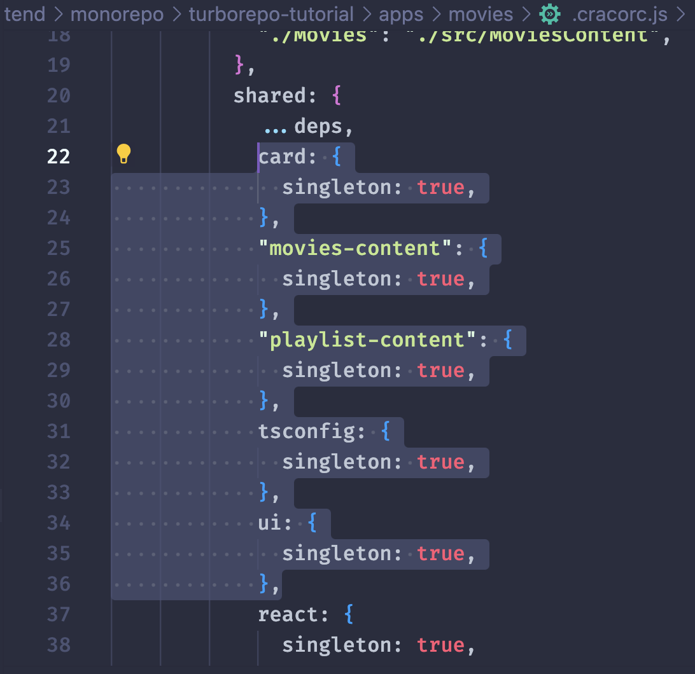
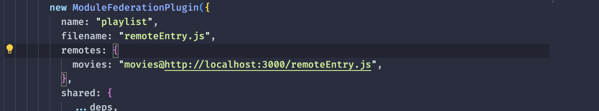

# Turborepo tutorial

## Movies App 제작

### 새로운 App 설치

`cd apps`로 이동한 뒤, `pnpx create-react-app movies --template typescript` 등 다양한 앱들을 삽입할 수 있습니다.

### default Apps 제거 & workspace의 tsconfig를 개별 App에 추가

기존에 nextjs 프로젝트인 docs, web 앱들을 제거해주고 새로운 앱을 주입합니다.<br>
그러기 위해, 먼저 apps/movies의 package.json 일부분 수정해줘야 합니다.


dependencies에 `"tsconfig": "workspace:*"`를 추가해줘서 turborepo 루트의 packages의 tsconfig를 따르도록 변경해줍니다.<br>
turborepo에서 `pnpm dev`로 실행할 예정이므로 스크립트도 start에서 dev로 변경해줍니다.

그리고 tsconfig.json을 기존 docs에 있는 코드 그대로 복사해서 주입해줍니다.

```js
// .../apps/movies/tsconfig.json

{
  "extends": "tsconfig/nextjs.json",
  "compilerOptions": {
    "plugins": [{ "name": "next" }]
  },
  "include": ["next-env.d.ts", "**/*.ts", "**/*.tsx", ".next/types/**/*.ts"],
  "exclude": ["node_modules"]
}

```

그리고 web, docs 앱 2개를 삭제하고 루트에서 pnpm dev를 실행하면 다음과 같이 뜹니다.<br>
movies app의 `App.test.tsx` 파일을 삭제해주면 됩니다.

- 참고로 위와 같이 설정을 바꿨다면, `cd movies`로 가서 `rm -fr node_modules/`로 모듈들을 제거한 뒤, 루트에서 다시 `pnpm install`을 하고 `pnpm dev`로 재시작해야 합니다.


### workspace의 ui packages를 개별 App에 추가 & CRA를 위한 pre-build

movies의 package.json에 workspace ui를 추가하고, 다시 루트에서 `pnpm install`를 합니다.


아래와 같이 movies app.tsx에서 ui packages에서 컴포넌트를 가져오면 에러가 발생합니다.


`/packages/ui`로 가서 다음과 같이 package.json을 수정합니다.

- scripts에 dev, build를 다음과 같이 추가합니다.
- main, types의 경로를 다음과 같이 수정합니다. dist에 build될 것이므로 ./dist에서 index.js와 index.d.ts를 찾아야 합니다.


그리고 나서 `cd packages/ui`로 가서 `pnpm build`를 수행한 뒤, 다시 루트에서 pnpm dev를 실행하면 정상적으로 import할 수 있습니다.

이렇게 해야 하는 이유는 다음과 같습니다. (그러므로 이후 workspace의 ui package를 사용할 때 pre-build를 해야 합니다.)

- nextjs는 webpack config가 cra과 다른 방식으로 되어 있습니다.
- cra의 경우 외부 모듈의 ts build를 지원하지 않습니다.
- 그러므로 우리는 packages/ui에서 typescript를 pre-build해야 합니다.

### 패키지 설치 및 리액트 버전 관리 (@mantine, react-router-dom)

@mantine 패키지를 packages/ui와 apps/movies에 각각 설치합니다.

```bash
cd packages/ui
pnpm add @mantine/hooks @mantine/core

cd ../../apps/movies/
pnpm add @mantine/hooks @mantine/core
```

그리고 나서 프로젝트 루트(../monorepo/turborepo-tutorial)에서 `pnpm i`를 입력한다.


mantine에 대한 `pnpm install`은 packages/ui > apps/movies, root(여기서는 turborepo-tutorial) 순으로 각각 해줍니다.

버전 충돌 문제는 react 버전을 18.1.~로 맞춰야 합니다.

react-router-dom은 packages/ui에만 설치합니다. `pnpm add react-router-dom@6.3.0`

packages/ui의 index.tsx에서 라우터를 구성합니다.<br>
apps/movies/src/App.tsx에서는 이제 path와 라우터에 들어갈 요소만 작성해주면 됩니다.

지금까지 관리 중인 터미널은 다음과 같이 3개입니다.



지금까지 작업을 아래 명령어를 통해 git으로 저장합니다.

- `git add .`는 삭제 파일을 반영하지 않습니다. `git add -A`는 삭제 파일 변경사항까지 포함합니다.

```bash
# .. /turborepo-tutorial

rm -fr .git
rm -fr apps/movies/.git

git init
git add -A
git commit -m "..."
```

### 전역 Store

```bash
cd packages
cp -r ui store # ui의 파일을 store로 복사합니다.
```

packages/store/package.json에서 name을 변경하고 불필요한 의존성 패키지를 제거합니다.

zustand를 설치합니다. 그리고 packages/store/index.tsx에 Store를 생성합니다.

```bash
cd packages/store
pnpm add zustand@4.0.0-rc.1
```

packages/ui/package.json에서 store를 가져오기 위해 workspace:store를 주입합니다.<br>
이렇게 가져온 store를 쓰려면 루트(turborepo-tutorial)에서 `pnpm i`를 한 번 해줘야 합니다.



### 전역 Card 컴포넌트

```bash
cd packages
cp -r ui card # packages/ui를 복사해서 card 컴포넌트를 생성합니다.
```

store 때처럼 packages/card/package.json에서 name을 변경하고, 불필요한 의존성 패키지를 제거합니다.<br>
packages/card/index.tsx에서 공통으로 사용할 Card 컴포넌트를 제작했다면, 이를 apps/movies에서 가져옵니다.

apps/movies/package.json에서 아래와 같이 workspace의 card 의존성을 추가합니다.<br>
이렇게 추가했다면, 루트에서 `pnpm i`을 반드시 해야 합니다.



## Playlist App 제작

movies 앱을 복사해 playlist 앱 템플릿을 만듭니다.

```bash
cd apps
cp -r movies playlist
```

이렇게 복사하면, node_modules가 꼬이는 경우가 종종 있습니다. 아래와 같이 제거합니다.

```bash
cd turborepo-tutorial
rm -fr node_modules/ apps/**/node_modules/
pnpm i
pnpm dev
```

apps/playlist/package.json에서 dev scripts를 아래와 같이 수정합니다.

```bash
"dev": "PORT=3001 react-scripts start"
```

## Apps에서 content를 추출하기

```bash
cd packages
cp -r ui movies-content
```

apps/movies/package.json에서 의존성 패키지에 "movies-content"를 추가합니다. 그외 필요한 package.json 등은 지금까지의 과정을 반복합니다.

playlist의 Content도 추출합니다.

```bash
cd packages
cp -r ui playlist-content
```

마찬가지로 앱과 패키지의 package.json을 연결합니다.

## Add Module Federation

### host 역할을 하는 Movies

craco(Create-React-App Configuration Override)를 설치합니다.

```bash
cd apps/movies
pnpm add @craco/craco -D
```

그리고 scripts를 변경합니다.

```js
// apps/movies/package.json

...

"scripts": {
    "dev": "craco start",
    "build": "craco build",
    "test": "craco test",
    "eject": "react-scripts eject"
  },
```

그리고 apps/movies에 `.cracorc.js`을 생성합니다.

```js
// apps/movies/.cracorc.js

const { ModuleFederationPlugin } = require("webpack").container;

const deps = require("./package.json").dependencies;

module.exports = () => ({
  webpack: {
    configure: {
      output: {
        publicPath: "auto",
      },
    },
    plugins: {
      add: [
        new ModuleFederationPlugin({
          name: "movies",
          filename: "remoteEntry.js",
          shared: {
            ...deps,
            react: {
              singleton: true,
              requiredVersion: deps.react,
            },
            "react-dom": {
              singleton: true,
              requiredVersion: deps["react-dom"],
            },
          },
        }),
      ],
    },
  },
});
```

그리고 노출할 context를 생성합니다.

```js
// apps/movies/src/MoviesContent.tsx

import React from "react";
import { MoviesContent } from "movies-content";
export default MoviesContent;
```

그리고 apps/movies/package.json에 exposes를 추가합니다.



그리고 shared의 ...deps가 package.json을 볼텐데, `workspace:*`를 읽지 못합니다.<br>
그래서 react, react-dom처럼 일일이 싱글톤으로 지정해줘야 합니다.



이렇게 설정하고 top-level에서 `pnpm dev`를 실행하면 아래와 같은 에러 메시지가 뜹니다.

`Shared module is not available for eager consumption`

이 메시지는 우리의 어플리케이션이 bootstrap되지 못하기 때문입니다. 웹팩을 지원하지 않고 있다는 의미입니다.

기존의 `apps/movies/src/index.tsx`를 `bootstrap.tsx`로 이름을 변경해줍니다.

그리고 별도의 `apps/movies/src/index.tsx`를 새로 생성해줍니다.

```js
// apps/movies/src/index.tsx
import("./bootstrap");

export default true;
```

그럼 이제 정상동작합니다.

`http://localhost:3000/remoteEntry.js`로 가면 entry 파일도 생성되었으니, 이제 연결하면 됩니다.

apps/playlist가 이제 remote 역할인 셈입니다. movies에서 exposes한 걸 가져오면 됩니다.

### remote 역할을 하는 playlist

```bash
cd apps/playlist
pnpm add @craco/craco -D
```

script를 carco로 변경하고, movies의 .cracorc.js를 복사해옵니다.

ModuleFederationPlugin의 name을 변경하고<br>
exposes를 제거한 뒤, 아래와 같이 remoteEntry.js를 추가합니다.



그리고 마찬가지로 index.tsx를 bootstrap.tsx로 변경하고 새로운 index.tsx를 생성합니다.

```js
// apps/playlist/src/index.tsx

import("./bootstrap");

export default true;
```

그리고 apps/playlist에서 사용헀던 workspace 패키지들을 마찬가지로 movies처럼 추가합니다.<br>
그리고 나서 top-level로 가서 `pnpm dev`를 하면 성공입니다.

그리고 이제 import를 host에서 가져오는 걸로 변경합니다.

```js
// apps/playlist/src/App.tsx

// @ts-ignore
import MoviesContent from "movies/Movies";

...
```
