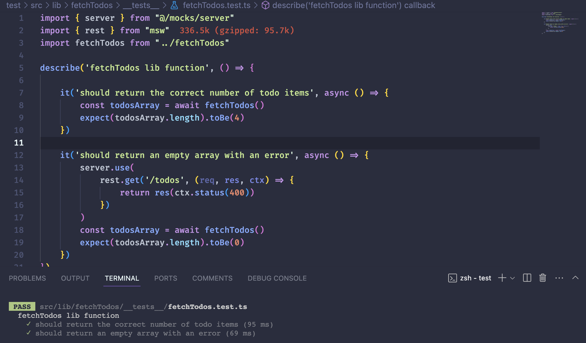

# Async testing in nextjs

## Features

### 패키지 설치 및 초기 설정

```bash
npm i react-icons@4.10.1

npm i -D @testing-library/jest-dom@5.16.5 @testing-library/react@14.0.0 @testing-library/user-event@14.4.3

npm i -D eslint-plugin-jest-dom@5.1.0 eslint-plugin-testing-library@6.0.1 jest@2
9.6.4 jest-environment-jsdom@29.6.4 ts-jest@29.1.1
```

package.json에 스크립트를 추가합니다.

```js
"test": "jest",
"test:watch": "jest -watchAll"
```

tsconfig의 include에 `"jest.setup.js"`를 추가합니다.

jest.setup.js 파일을 생성합니다.

```js
// jest.setup.js

// Optional: configure or set up a testing framework before each test.
// If you delete this file, remove `setupFilesAfterEnv` from `jest.config.js`

// Used for __tests__/testing-library.js
// Learn more: https://github.com/testing-library/jest-dom
import "@testing-library/jest-dom/extend-expect";
```

jest.config.js 파일을 생성합니다.

```js
// jest.config.js

const nextJest = require("next/jest");

const createJestConfig = nextJest({
  // Provide the path to your Next.js app to load next.config.js and .env files in your test environment
  dir: "./",
});

// Add any custom config to be passed to Jest
/** @type {import('jest').Config} */
const config = {
  setupFilesAfterEnv: ["<rootDir>/jest.setup.js"],
  testEnvironment: "jest-environment-jsdom",
  preset: "ts-jest",
  verbose: true,
};

// createJestConfig is exported this way to ensure that next/jest can load the Next.js config which is async
module.exports = createJestConfig(config);
```

eslint에 plugin을 추가합니다.

```js
// .eslintrc.json

{
  "extends": [
    "next/core-web-vitals",
    "plugin:testing-library/react",
    "plugin:jest-dom/recommended"
  ]
}
```

msw와 whatwg-fetch를 설치합니다.

- whatwg-fetch는 fetch에 대한 폴리필을 제공합니다.

```bash
npm i -D msw@1.3.0 whatwg-fetch
```

### mock rest api를 사용하기 위한 세팅

msw 콜백함수에서 3번째 인자인 ctx는 context를 의미합니다. 상태코드나 json과 같은 응답을 보냅니다.

```js
// mocks/handlers.ts

import { rest } from "msw";

export const handlers = [
  rest.get("/todos", (req, res, ctx) => {
    return res(ctx.status(200), ctx.json(/* ... */));
  }),
];
```

server는 아래와 같이 작성합니다.<br>
핸들러는 여러 개의 rest api를 담고 있으므로 스프레드 연산자를 사용해야 합니다.

```js
// mocks/server.ts

import { setupServer } from "msw/node";
import { handlers } from "./handlers";

export const server = setupServer(...handlers);
```

jest.setup.js에서 server를 가져오고 before, after 설정 코드를 통해, 모든 테스트 전에 모의서버가 열리도록 설정합니다.

### Test /GET

그리고 나서, api crud 핸들러를 lib 폴더 하위에 제작합니다.<br>
각각의 핸들러는 폴더로 먼저 만들어서 내부에서 테스트 코드를 작성할 수도 있습니다.

각각의 폴더 하위에 `__tests__`를 만들면 됩니다.

예를 들어, `__tests__` 폴더 내부에 있는 fetchTodos.test.ts 파일은 유닛테스트만을 포함하므로 tsx를 쓸 필요 없습니다.



위 이미지를 보면, describe의 첫번째 인자로 작성한 문구로 유닛테스트가 시작됩니다.<br>
`it`로 작성한 테스트가 한 줄 한 줄 실행됩니다.<br>
두번째 it에서는 실패를 테스트합니다. 그래서 일부러 rest.get의 상태코드를 400으로 설정하고 fetch를 진행합니다.<br>
err 발생 시 빈 배열을 받도록 코드를 작성했으므로 expect에 작성한 0이 통과합니다.

### Test /DELETE, /POST, /PUT

mocks/handlers에 rest.post, rest.put, rest.delete를 작성합니다.<br>
lib 하위에 각각 핸들러에 맞는 테스트 코드를 작성합니다.

## References

[How to Mock a REST API Server for Testing with Jest & React Testing Library](https://www.youtube.com/watch?v=k0LPNKWCxx0)<br>
[setupServer | msw](https://mswjs.io/docs/api/setup-server/)<br>
[Node.js integration](https://mswjs.io/docs/integrations/node/#test-runner)<br>
