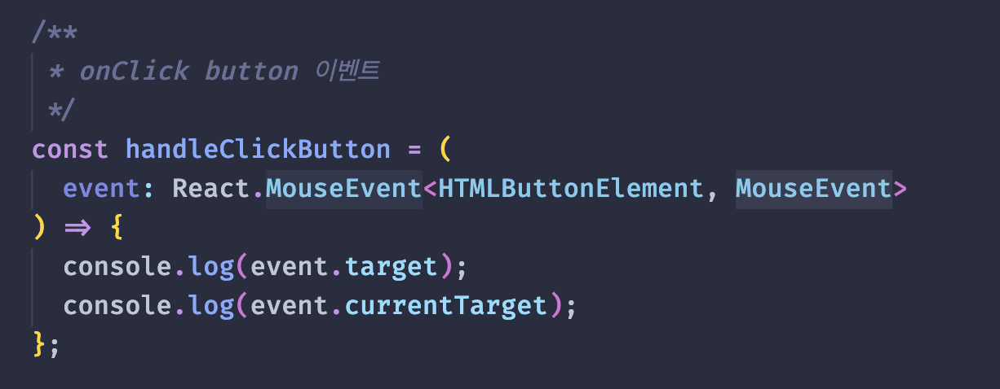
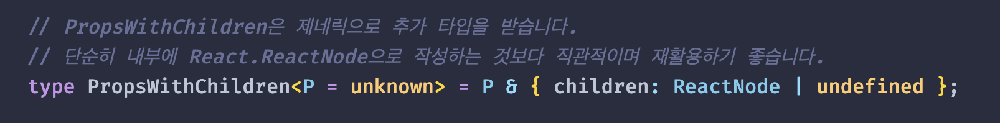

# Writing Types More Specifically

## Features

[Event Types](./src/examples/event.example.ts) 
event 타입의 경우 inline으로 작성한 mock tag에 hover하는 게 가장 정확합니다. 
기본적으로 MouseEvent에 제네릭으로 Element 타입을 넘겨줍니다

[직관적인 children type](./src/examples/children.example.ts) 
children type을 구체적이고 확장성있게 작성합니다.

## References

- [Type the onClick event of an element in React (TypeScript)](https://bobbyhadz.com/blog/typescript-react-onclick-event-type)
