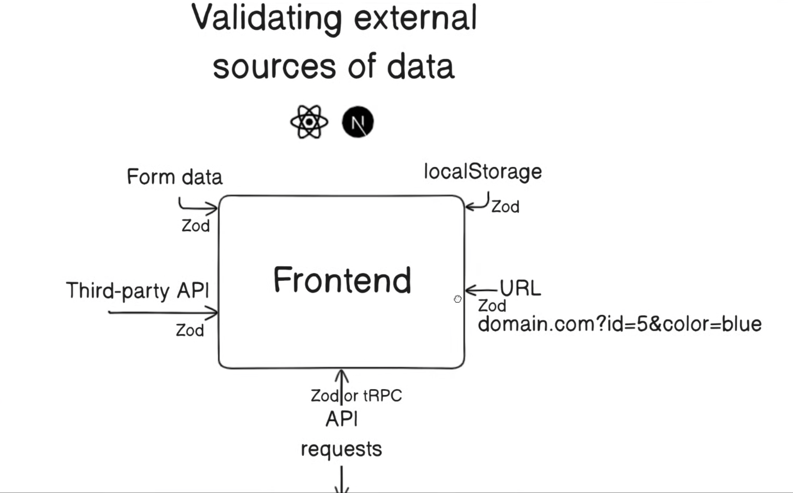
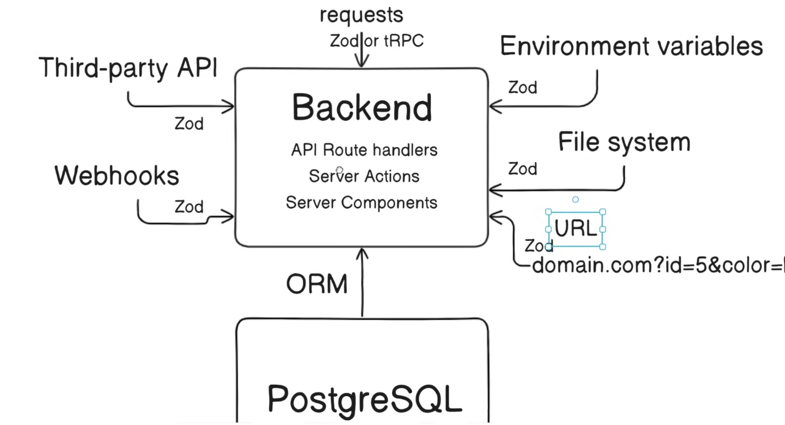

# Web Components

## Features

typescript만으로는 외부 데이터를 확실하게 검증하기 어렵습니다. 
zod(schema validator like ZOD)와 함께 외부 데이터를 검증하는 아키텍쳐를 고려해봅니다.

### Frontend Architecture

[API requests from backend & Third party API](./examples/api-requests/product.tsx)

- 타입스크립트는 컴파일 단계에서만 존재합니다. 런타임 이후 백엔드의 데이터 형식이 변경된다면, 런타임 환경에서 프론트가 작성한 타입스크립트는 아무런 힘을 발휘하지 못합니다.
- 옵셔널 체이닝(`?`)을 사용하더라도 코드만 더 지저분해집니다. 게다가 옵셔널체이닝의 또 다른 문제점은 불가능한 메서드에 대해 방어 효과가 없다는 점입니다. 이를 방지하기 위해 `if(typeof ... )` 같은 코드로 타입가드를 하려는 순간 코드는 더러워지기 시작합니다.
- `npm i zod`로 설치한 zod는 런타임 환경에서 의존하므로 ts의 단점을 보완합니다.
- 서드파티 api의 경우 zod로 충분하지만, 백엔드 요청의 경우 `zod` 또는 `tRPC`를 사용할 수 있습니다.

[Form data](./examples/form-data/checkout-form.tsx)

- rhf과 같은 라이브러리로 form data를 클라이언트 측에서 관리하더라도, 결국 이 form data를 백엔드로 제출해야 하므로 zod와 같은 스키마 검증 도구가 필요합니다.
- 보다 자세한 코드는 [여기](https://github.com/wooleejaan/yw-frontend/blob/main/react-hook-form-with-zod/components/form-with-rhf-and-zod-and-server.tsx)에서 확인할 수 있습니다.

[LocalStorage](./examples/local-storage/cart.tsx)

[URL (domain.com?id=5&color=blue)](./examples/url-as-state/product2.tsx)

### Backend Architecture

여기서 백엔드는, nextjs api를 기준으로 고려합니다.

- API Route Handlers
- Server Actions
- Server Components

기본적으로 백엔드는 클라이언트에서 오는 그 어떤 것도 신뢰할 수 없습니다. 
클라이언트에서 오는 request에 대해 기본적으로 `zod`를 사용하거나 더 강력한 `tRPC`를 사용합니다.

[Webhooks]()

예를 들어, 결제 모듈 등을 붙인다고 하면, 응답으로 정보들을 받습니다. 이에 대해 검증 절차가 필요합니다.

[Third party API]()

백엔드도 서드파티 api를 사용해 외부 데이터를 받을 수 있습니다. 이에 대한 검증 절차가 필요합니다. 

중앙에서 사용할 zod를 작성하고, zod를 활용해 type까지 작성한 뒤, 이를 백/프론트 모두에서 활용한다면, 외부 데이터를 검증하는 제어권을 우리가 가져올 수 있습니다.

서드파티, 웹훅 등에서는 심지어 tRPC를 사용할 수 없으므로, zod와 같은 타입 검증이 필요합니다.

- [Validate with zod](./lib/validations.ts)
- [Extend schema written in zod to incorporate ts](./lib/types.ts)
- [api with zod](./app/api/form/route.ts)

[Environment Variables]()

환경변수를 앱에 로드할 때, 문제가 발생할 수 있습니다. 
zod로 파싱해주면, 자동완성 기능도 적극적으로 사용할 수 있습니다.

- [env with zod](./env.ts)
- [use env in api](./app/api/env/route.ts)

[File System]()

파일시스템도 외부 데이터로 간주합니다. 파일 시스템을 읽는 과정에서도 충분히 문제가 발생할 수 있습니다.

- [validate json with zod](./app/api/file-system/route.ts)

[URL]()

백엔드도 프론트엔드와 마찬가지로 Url에서 데이터를 가져올 수 있습니다.

- [validate url in server component](./examples/product-server/product3.tsx)

[ORM]()

데이터베이스 서버에서 데이터를 불러오는 것도 검증 절차를 필요로 합니다.

- [prisma with zod](./examples/prisma-server/product-page.tsx)

## References

- [ALWAYS use Zod in these 10 places in your React app (+ Next.js / TypeScript / Zod Tutorial)](https://www.youtube.com/watch?v=AeQ3f4zmSMs)

### to be read
